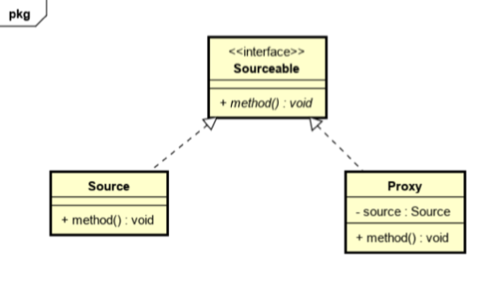

基本概念 
代理模式就是找一个代理类替原对象进行一些操作。 
比如我们在租房子的时候找中介，再如我们打官司需要请律师，中介和律师在这里就是我们的代理。

实际意义 
如果在使用的时候需要对原有的方法进行改进，可以采用一个代理类调用原有方法，并且对产生的结果进行控制，这种方式就是代理模式。 
使用代理模式，可以将功能划分的更加清晰，有助于后期维护。

代理模式和装饰器模式的比较 装饰器模式通常的做法是将原始对象作为一个参数传给装饰者的构造器，而代理模式通常在一个代理类中创建一个被代理类的对象。
装饰器模式关注于在一个对象上动态的添加方法，然而代理模式关注于控制对对象的访问。